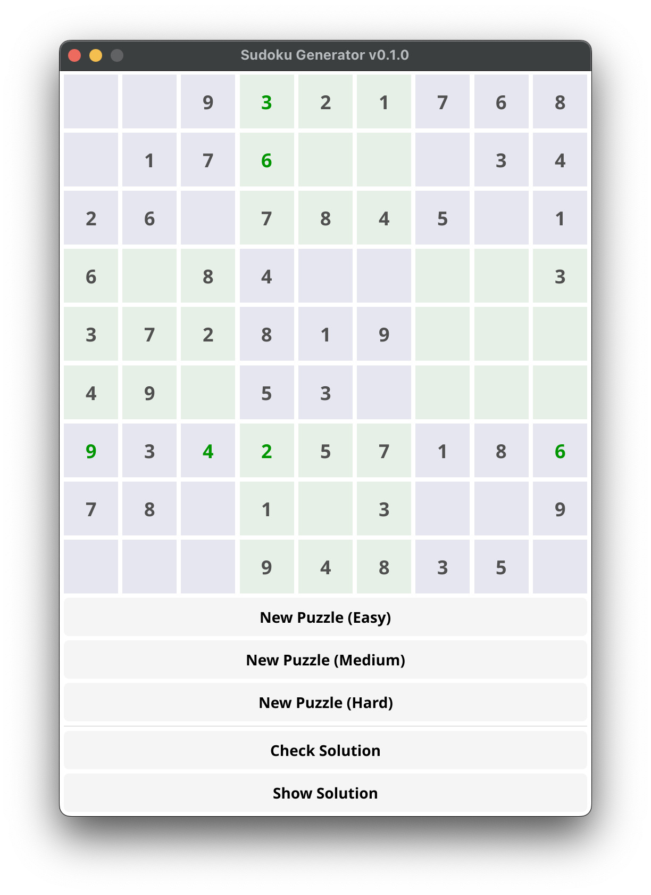

# Fyne Sudoku Generator (v0.1.0)

A simple, playable Sudoku puzzle generator built using Go and the Fyne GUI toolkit.

## Screenshot



## Features

*   Generates new Sudoku puzzles with varying difficulty levels (Easy, Medium, Hard).
*   Allows user input into empty cells (digits 1-9 only).
*   Provides immediate visual feedback (Green/Red text color) for user input against the solution.
*   Custom cell widget for a clean appearance without default input borders/backgrounds.
*   Custom light theme with alternating grey background blocks for better readability.
*   Option to check the current state of the puzzle (checks for completeness and highlights errors via text color).
*   Option to reveal the complete solution.

## Prerequisites

*   **Go:** Version 1.21 or later (required for built-in `min`/`max` functions). You can download it from [golang.org](https://golang.org/dl/).
*   **Fyne Prerequisites:** You need the necessary graphics drivers and development tools for your operating system. Follow the instructions on the Fyne website: [Getting Started - Fyne Docs](https://developer.fyne.io/started/)

## How to Build and Run

1.  **Clone or Download:** Get the project code. If using Git:
    ```bash
    git clone https://github.com/chunghha/fyne_sudoku
    cd fyne-sudoku
    ```

2.  **Navigate:** Open your terminal or command prompt in the project's root directory (`fyne-sudoku`).

3.  **Fetch Dependencies:**
    ```bash
    go mod tidy
    ```

4.  **Run:**
    ```bash
    go run .
    ```

5.  **(Optional) Build Executable:** To create a standalone executable:
    ```bash
    go build .
    ```
    This will create an executable file (e.g., `fyne-sudoku` or `fyne-sudoku.exe`) in the current directory.

## How to Play

1.  **Generate Puzzle:** Click one of the "New Puzzle" buttons to create a Sudoku grid.
2.  **Input Numbers:**
    *   Click on an empty cell (with a grey background) to select it.
    *   Type a digit from 1 to 9.
    *   The number will appear, colored Green if correct or Red if incorrect according to the hidden solution.
    *   Use Backspace or Delete to clear a number from a cell (the text color will reset).
3.  **Check Solution:** Click "Check Solution" to get a message indicating if the puzzle is complete and correct (based on whether any red numbers remain).
4.  **Show Solution:** Click "Show Solution" to fill in all remaining correct numbers and disable the grid.

## Dependencies

*   [Fyne GUI Toolkit](https://fyne.io/) (`fyne.io/fyne/v2`)

## Known Issues / Notes

*   The code uses a custom widget (`sudokuCell`) to achieve the desired visual appearance (numbers centered on colored backgrounds).
*   Text centering within the cell (`entry.TextAlign`) caused persistent build errors in the development environment and is currently disabled in the custom widget's renderer. Text alignment relies on the `canvas.Text` default behavior.

## License

This project is licensed under the MIT License. See the [LICENSE](LICENSE) file for details.
